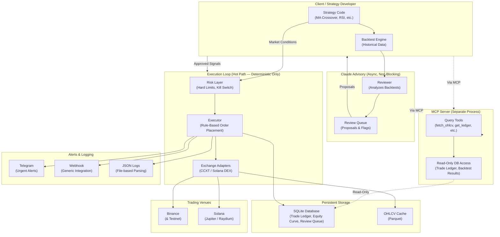

# Crypto Algo Trading Agent

A hybrid algorithmic trading agent for **centralized exchanges (CCXT)** and **Solana DEX venues**, with deterministic risk/execution and Claude advisory capabilities.

**Status**: Phase 1 complete — configuration, logging, and folder structure ready.

---

## Architecture



---

## Quick Start

### Prerequisites

- **Python 3.11+**
- **pip** or **uv** (package manager)
- **.env file** (copy from .env.example)

### 1. Clone & Setup

```bash
git clone <repo>
cd Crypto_Algo_Trading_Agent

# Copy example config
cp .env.example .env

# Create virtual environment (recommended)
python -m venv venv
source venv/bin/activate  # On Windows: venv\Scripts\activate

# Install dependencies
pip install -e ".[dev,test]"

# Install MCP dependencies (optional, for Claude integration)
pip install -e ".[mcp]"
```

### 2. Configure .env

Edit `.env` with your exchange API credentials:

```bash
# Dry-run mode (default safe)
DRY_RUN=true

# Binance testnet
BINANCE_API_KEY=your_testnet_key
BINANCE_API_SECRET=your_testnet_secret
BINANCE_TESTNET=true

# Solana (Helius RPC recommended)
SOLANA_RPC_URL=https://mainnet.helius-rpc.com/?api-key=YOUR_HELIUS_KEY
SOLANA_WALLET_PRIVATE_KEY=your_base58_secret

# Notifications (optional)
ENABLE_TELEGRAM=false
TELEGRAM_BOT_TOKEN=your_bot_token
TELEGRAM_CHAT_ID=your_chat_id

# Risk limits
MAX_NOTIONAL_PER_TRADE=1000.0
MAX_DAILY_LOSS=5000.0
MAX_CONCURRENT_POSITIONS=5
```

### 3. Run (Phase 1)

```bash
python -m src.main
```

**Output** (Phase 1):
```
================================================================================
Crypto Algo Trading Agent Starting
================================================================================
[2026-06-20 10:30:45] INFO     src.main: DRY_RUN=true — no live trades will be executed
[2026-06-20 10:30:45] INFO     src.main: Configuration loaded, logging initialized
[2026-06-20 10:30:45] INFO     src.main: Ready for Phase 2: Exchange Adapters
```

Logs written to `logs/trading_agent.log` in both:
- **JSON format** (structured, parseable by advisory module)
- **Console** (human-readable development view)

---

## Project Structure

```
crypto_algo_trading_agent/
├── src/
│   ├── adapters/              # Exchange abstraction (CCXT, Solana)
│   ├── strategies/            # Pluggable strategies (MA, RSI, etc.)
│   ├── risk/                  # Hard limits, kill switch, position management
│   ├── execution/             # Order placement (rule-based, no LLM)
│   ├── backtest/              # Backtesting engine, historical data
│   ├── advisory/              # Claude advisor + MCP server (async, read-only)
│   ├── data/                  # Database models, OHLCV cache
│   ├── notifications/         # Telegram, webhooks, alerts
│   ├── config/                # Settings loader (pydantic)
│   ├── logging_setup.py       # Dual-handler logging (JSON + console)
│   └── main.py                # Entry point
├── tests/                     # pytest suite (80%+ coverage on risk/execution)
├── pyproject.toml             # Dependencies, tool config (mypy, pytest, etc.)
├── .env.example               # Config template (never commit .env)
├── .gitignore
├── CLAUDE.md                  # This seed prompt (persistent context)
└── README.md                  # (you are here)
```

---

## Dependency Highlights

| Package | Purpose |
|---------|---------|
| `ccxt` | Centralized exchange abstraction (Binance, Bybit, etc.) |
| `solana-py` | Solana blockchain client (for Jupiter swaps, wallet management) |
| `httpx` | Async HTTP client (Jupiter API, Helius RPC) |
| `pydantic` | Config validation & schema integrity |
| `sqlalchemy` | Database ORM (SQLite to Postgres-ready) |
| `pandas` | Data manipulation (backtests) |
| `pyarrow` | Parquet support (OHLCV cache) |
| `structlog` | Structured logging (JSON events) |
| `pytest-asyncio` | Async test support |
| `python-telegram-bot` | Telegram alerts |
| `mcp` | Model Context Protocol (Claude integration) |

---

## Hard Limits (Non-Negotiable)

Enforced in code before any `place_order()` call:

| Limit | Config Key | Behavior |
|-------|-----------|----------|
| **DRY_RUN gate** | `DRY_RUN`, `live_trading_confirmation` | Two separate gates; both required to flip to live |
| **Max notional per trade** | `MAX_NOTIONAL_PER_TRADE` | Hard cap, config-driven |
| **Max daily loss** | `MAX_DAILY_LOSS` | Auto-trips kill switch, Telegram alert |
| **Max drawdown** | `MAX_DAILY_DRAWDOWN_PERCENT` | Kill switch if breached |
| **Max concurrent positions** | `MAX_CONCURRENT_POSITIONS` | Rejects signals that exceed limit |
| **Stop-loss requirement** | Risk layer | Every live position must define one |
| **Order cooldown** | `ORDER_COOLDOWN_SECONDS` | Rate limit between orders |
| **Kill switch test** | `test_kill_switch()` | Dedicated unit test, actually halts execution |

---

## Going Live Checklist

**Before enabling `DRY_RUN=false` and live trading:**

- [ ] **Configuration**
  - [ ] `.env` created from `.env.example` (never commit real keys)
  - [ ] Exchange API keys tested in sandbox/testnet (Binance testnet, Solana devnet)
  - [ ] `MAX_NOTIONAL_PER_TRADE` set to smallest amount you can afford to lose completely
  - [ ] `MAX_DAILY_LOSS` and `MAX_DAILY_DRAWDOWN_PERCENT` conservative

- [ ] **Risk Layer (Phase 4)**
  - [ ] Kill switch implemented and unit-tested
  - [ ] All hard limits enforced in `src/risk/` and `src/execution/`
  - [ ] Run: `pytest tests/ -k risk_limits -v`

- [ ] **Notifications (Phase 6)**
  - [ ] Telegram bot token configured and tested
  - [ ] Mock a kill-switch trigger and verify Telegram alert reaches your phone
  - [ ] Webhook (if used) tested with dry-run trades

- [ ] **Backtest (Phase 3)**
  - [ ] Strategy backtested against 2+ years historical data
  - [ ] Win rate, drawdown, Sharpe ratio documented
  - [ ] Strategy code reviewed for edge cases (gaps, low-liquidity pairs, etc.)

- [ ] **Execution (Phase 4)**
  - [ ] Dry-run mode tested for 1 week minimum
  - [ ] Orders placed correctly (size, direction, stop-loss)
  - [ ] Fills match exchange expectations
  - [ ] Equity curve matches backtest assumptions

- [ ] **Advisor Integration (Phase 5+)**
  - [ ] MCP server running and Claude can query backtest results
  - [ ] Advisory suggestions reviewed before implementation
  - [ ] No auto-apply of Claude proposals (human gate always on)

- [ ] **Final Checks**
  - [ ] All tests pass: `pytest tests/ -v --cov=src --cov-report=term-missing`
  - [ ] Code is mypy-clean on safety-critical paths: `mypy src/risk src/execution src/adapters`
  - [ ] README and docs up to date
  - [ ] `.gitignore` confirmed (no API keys anywhere)
  - [ ] You have time to monitor live trading for at least the first week

---

## Phase Roadmap

| Phase | Goal | Status |
|-------|------|--------|
| 0 | Architecture & configuration | ✅ Complete |
| 1 | Scaffold, logging, config | ✅ Complete |
| 2 | Exchange adapters (CCXT, Solana) | ⏳ Next |
| 3 | Backtest engine & strategies | ⏳ |
| 4 | Risk & execution with hard limits | ⏳ |
| 5 | Claude advisory + MCP server | ⏳ |
| 6 | Notifications & CLI | ⏳ |
| 7 | Tests, docs, going-live checklist | ⏳ |

---

## Testing

```bash
# All tests
pytest tests/ -v

# Specific test file
pytest tests/test_risk_limits.py -v

# With coverage
pytest tests/ --cov=src --cov-report=term-missing

# Async tests only
pytest tests/ -m asyncio -v

# Watch mode (with pytest-watch)
ptw tests/
```

**Coverage target**: **80%+ on `risk/` and `execution/`** (safety-critical path).

---

## Type Checking

```bash
# Mypy on safety-critical path (strict)
mypy src/risk src/execution src/adapters --strict

# All modules (relaxed)
mypy src/
```

---

## Code Quality

```bash
# Format
black src/ tests/

# Imports
isort src/ tests/

# Lint
ruff check src/ tests/
```

---

## Logging

Two handlers, one logger:

1. **JSON to file** (`logs/trading_agent.log`)
   - Structured, parseable by advisory module & dashboards
   - Example:
     ```json
     {
       "timestamp": "2026-06-20T10:30:45Z",
       "level": "INFO",
       "logger": "src.execution",
       "message": "Order placed: BTC/USDT 0.01 @ limit 65000",
       "event_type": "trade_fill"
     }
     ```

2. **Human-readable to console** (stdout)
   - Development-friendly timestamps and context
   - Example:
     ```
     [2026-06-20 10:30:45] INFO     src.execution: Order placed: BTC/USDT 0.01 @ limit 65000
     ```

---

## FAQ

**Q: Why CCXT + separate Solana adapter?**
> CCXT covers 100+ centralized exchanges well but doesn't handle Solana AMM swaps (Jupiter/Raydium). The shared `ExchangeAdapter` ABC keeps strategy & risk layers venue-blind.

**Q: Why is Claude not in the execution loop?**
> Live trading requires deterministic, unit-testable order logic. LLM calls add latency, cost, and failure modes. The advisory pattern (Claude reviews backtests async) gets reasoning benefits without the risks.

**Q: How do I start with real capital?**
> DRY_RUN defaults to `true`. To flip to live, set `DRY_RUN=false` AND provide the exact confirmation string. Start with the smallest notional cap you can afford to lose completely while you watch for a week.

**Q: What if I want to add a new exchange?**
> Implement the `ExchangeAdapter` ABC (8 methods: `get_ticker`, `get_ohlcv`, `get_balance`, `place_order`, `cancel_order`, `get_open_positions`, etc.). Strategy & risk layers never change.

---

## References

- **CCXT**: https://github.com/ccxt/ccxt
- **Solana-py**: https://github.com/michaelhly/solana-py
- **Pydantic**: https://docs.pydantic.dev/latest/
- **SQLAlchemy**: https://docs.sqlalchemy.org/
- **Helius**: https://helius.dev/
- **Jupiter API**: https://docs.jup.ag/
- **Freqtrade** (reference strategy architecture): https://www.freqtrade.io/
- **MCP Framework**: https://modelcontextprotocol.io/

---

## License

MIT

---

## Next Steps

1. **Copy `.env.example` → `.env`** and add your testnet API keys.
2. **Run Phase 1**: `python -m src.main` (should log config and exit cleanly).
3. **Say "continue"** to proceed to Phase 2 (exchange adapters).

---

**Built with ❤️ for algorithmic traders who understand their risk.**
